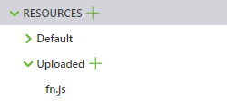
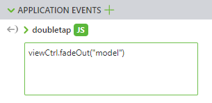
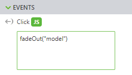

# VuforiaStudioExtensions

## Introduction

This document contains a collection of (more or less) useful snippets that can be used in Vuforia Studio projects.
Most examples use "fn.js" - a JavaScript file that can be included in any project with the following steps:

1. Download "fn.js" from this repository
1. Add "fn.js" as resource to your Vuforia Studio project

    

1. Load "fn.js" from each view by adding the following command at the beginning of your .js file

    ```js
    // $scope, $element, ...

    $scope.app.fn.loadResourceScript("Uploaded/fn.js")
    ```

> Functions defined in "fn.js" are added to the views' `$scope`.
> So the function call varies depending on where you want to insert it:
>
> * Inside &lt;view&gt;.js - `$scope.fadeOut("model")`
> * Inside application event handlers (3D eyewear only) - `viewCtrl.fadeOut("model")`
>
>   
> * Inside model property event handlers - `fadeOut("model")`
>   * If you want to refer to the current model you can use `me` instead of the model name, e.g. `fadeOut(me)`.
>
>   

## Examples

### Fade in/out widget

* `fadeOut("model")`
* `fadeIn("model")`
* `fadeOut("model", 3000)` - Fade out over 3 seconds

### Control widget visibility

* `show("model")`
* `hide("model")`
* `toggleVisibility("model")` - Hide if visible, show if hidden

### Highlight a widget

* `flash("model")` - Highlight a widget by toggling its visibility
* `flash("model", 4)` - Show and hide a widget four times
* `flash("model", 4, 500)` - Show and hide a widget four times and keep each state for 500ms
* `highlight("model")` - Highlight a widget by changing it's color
* `highlight("model", 5)` - Change a widget's color five times
* `highlight("model", 5, 40)` - Highlight by using a [hue](https://www.w3schools.com/colors/colors_hsl.asp) value of 40

### Change widget scale

* `scale("model", 2)` - Animate making a model twice as big as usual
* `scale("model", 2, 1000)` - Animate scale change over 1 second
* `scale("model", 2, 1000, 100)` - Animate scale change over 1 second in 100ms intervals

### Change widget property

> Widget property is changed immediately (without animation).

* `changeProperty("model", "x", 0.05)` - Move widget 0.05m along the x axis

### Rotate widget

> Widget rotation is changed immediately (without animation).

* `rotate("model", "x", 30)` - Rotate widget by 30 degrees along the x axis

### Animate a widget property

> The widget property is changed continuously (animated).
>
> Warning: While there might be several active animations for a single widget, there can't be more than one animation for a single widget property.

* `animateFromTo("model", "y", 1.2, 0.046)` - Animate y axis movement from 1.2m to 0.046m
* `animateTo("model", "y", 0.046)` - Animate y axis movement from current position to 0.046m
* `animateBy("model", "y", 0.01, 50)` - Continuously change y value by 0.01m per 50ms
* `stopAnimation("model", "y")` - Stop y axis movement
* `toggleAnimateFromTo("model", "y", 1.2, 0.046)` - Start movement if stopped, stop if started
* `toggleAnimateTo("model", "y", 0.046)` - Start movement if stopped, stop if started
* `toggleAnimateBy("model", "y", 0.01, 50)` - Start continuous movement if stopped, stop if started
* `animateRotation("model", "y", 1, 50)` - Continuously change y axis rotation by 1 degree per 50ms
* `stopRotation("model", "y")` - Stop y axis rotation
* `toggleRotation("model", "y", 1, 50)` - Start rotation if stopped, stop if started

### Change source of a 3D image

* `setImageSource("play-button", "pause.png")`
  * Ensure "pause.png" exists as an uploaded resource

### Change widget color

> A color is defined by its red, green and blue value (0 <= v <= 255). It's probably good advice to use a [color picker](https://colorpicker.me/).

* `setColor("model", 255, 0, 0)` - Set color to red
* `resetColor("model")` - Reset to original color

### Change a widget's color by using a color list

* Put the following snippet into &lt;view&gt;.js:

  ```js
  // Define a list of colors with red, green, blue and transparency values
  // Using "" resets the color to the original one
  let colors = ["rgba(255, 0, 0, 1)", "rgba(0, 255, 0, 1)", "rgba(0, 0, 255, 1)", ""]
  let selectedColor = 0 // The index of the current color (list indices start with 0)

  $scope.changeColor = () =>
  {
      $scope.setColor("model", colors[selectedColor])
      selectedColor = (selectedColor + 1) % colors.length
  }
  ```

* `changeColor()` - Set next color

### Do something based on the current step of a model sequence

> The following example changes the text of a label based on the current step of a model sequence. You can also use "playstarted" instead of "newStep" so that the label text is changed as soon as a step is started. So when playing sound "playstarted" might be the better choice. When showing a label, "newStep" might be the right choice.

```js
$scope.$on("newStep", () =>
{
    let currentStep = $scope.getCurrentStep("model")
    if (currentStep == 1)
    {
        $scope.setProperty("description", "text", "Turn off the engine")
    }
    else if (currentStep == 2)
    {
        $scope.setProperty("description", "text", "Remove the screws")
    }
    else if (currentStep == 3)
    {
        $scope.setProperty("description", "text", "Replace the damaged part")
    }
    else
    {
        $scope.setProperty("description", "text", "")
    }
})
```

### Play sound

* `playSound("http://soundbible.com/grab.php?id=1587&type=mp3")` - Load sound file from the internet (Warning: The playback might be delayed)
* `stopSound("http://soundbible.com/grab.php?id=1587&type=mp3")` - Stop playback
* `playSound("app/resources/Uploaded/sound.mp3", true)` - Repeat playback of sound file uploaded as resource
* `stopSound("app/resources/Uploaded/sound.mp3")` - Stop playback

### Open a website

* `window.open("https://example.com/")`

### Load different models based on a model list

> Warning: After changing the model you might select the right sequence if necessary.

```js
let models = [
    "model1.pvz",
    "model2.pvz"
]
let modelIndex = 0;
$scope.nextModel = widgetId =>
{
    modelIndex = (modelIndex + 1) % models.length;
    $scope.setModel(widgetId, models[modelIndex]);
}
```

* `nextModel("model")` - Set next model

### Taking apart a model

```js
let selectedWidget
$scope.setWidget = widgetId =>
{
    if (selectedWidget === undefined)
    {
        selectedWidget = widgetId
        $scope.setColor(widgetId, 255, 0, 0)
    }
    else
    {
        selectedWidget = undefined
        $scope.resetColor(widgetId)
    }
}
let fly = (axis, offset, offsetFactor) =>
{
    if (selectedWidget === undefined)
    {
        console.error("No model selected")
    }
    else
    {
        axis = axis !== undefined ? axis : "z"
        offset = offset !== undefined ? offset : 1
        let propertyValue = $scope.getProperty(selectedWidget, axis)
        $scope
            .animateTo(selectedWidget, axis, propertyValue + offset * offsetFactor)
            .then(() =>
            {
                $scope.resetColor(selectedWidget)
                selectedWidget = undefined
            })
    }
}
$scope.flyAway = (axis, offset) => fly(axis, offset, 1)
$scope.flyBack = (axis, offset) => fly(axis, offset, -1)
```

> Important: Every widget that should be removed needs `setWidget(me)` as click event handler.
> Then in an application event handler (e.g. `doubletap`) write `viewCtrl.flyAway()` and in another one `viewCtrl.flyBack` to trigger removing the selected widget.
> Note that before you can remove an element you have to select it by clicking on it (the selected widget becomes red).

## Contributors

This library wouldn't be what it is without the help of DI Eva Weigl, PhD. Thanks a lot.
